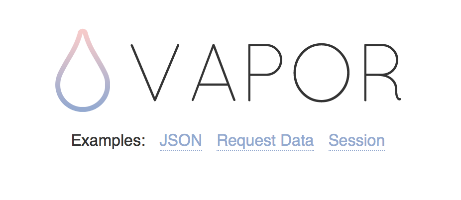

Ever since Apple announced that Swift was going to be open source, I've been interested in the development of moving Swift to the backend. Being an old web developer myself who is still doing some web stuff, I found it exciting to be able to re-use my knowledge of a programming language across frontend and backend. Although I still believe you learn a lot from knowing multiple languages, you can't deny that you would be more productive, and learn more about the language when being to able to use it across platforms. With that said, I want to give a quick start for getting started with Swift on the web, so let's dive in.

# Choosing your Swift web framework

It's clear that a lot of people besides me is interesting in moving Swift to the web, and it shows clearly when you look at some of the options to choose between when wanting to do Swift web development:

- [Perfect](https://github.com/PerfectlySoft/Perfect)
- [Vapor](https://github.com/tannernelson/vapor)
- [Taylor](https://github.com/izqui/Taylor)
- [Swifter](https://github.com/glock45/swifter)

I haven't tried all of these options, but what I can do, is to try and reason about the framework I chose to move forward with. 

Perfect is without doubt the most widespread and developed framework for moving Swift to the backend. To me, it seems like their focus is much about sharing Swift code between frontend and backend, e.g. by sharing examples where both projects (being frontend and backend) is living in the same Xcode workspace. Although I'm a big fan of this idea, I simply just felt that the setup seemed a bit too much, and I wanted something simpler.

Vapor is another approach which is quite different from Perfect. Instead of making a tight coupling between your mobile app and the backend, it seems to me that Vapor is trying to make a more independent web framework for using Swift on the web. It's inspired by [Laravel](https://laravel.com) and in general I found the project to appeal more to me, while also seeming simple to setup.

As for Taylor and Swifter they either seemed unmaintained or lacking features I would need for my backend. I ended up choosing Vapor for this setup.

# Setting up Vapor

## Step 1: Install Swift 2.2

Vapor requires Swift 2.2 at the time of writing, so the first step would be to go to Swift.org's [download page](https://swift.org/download/) and download it. I experienced some problems with the latest snapshots, and after reading on Reddit, I recommend to use the following snapshot as this was the latest snapshot working for me:

`swift-2.2-SNAPSHOT-2016-01-11-a`

This package can be downloaded [here](https://swift.org/builds/swift-2.2-branch/xcode/swift-2.2-SNAPSHOT-2016-01-11-a/swift-2.2-SNAPSHOT-2016-01-11-a-osx.pkg) for OSX and [here](https://swift.org/builds/swift-2.2-branch/ubuntu1510/swift-2.2-SNAPSHOT-2016-01-11-a/swift-2.2-SNAPSHOT-2016-01-11-a-ubuntu15.10.tar.gz) for Linux.

After downloading and installing the package you're now able to use Swift 2.2 in Xcode 7.3 beta. However, in order to use this from the terminal, run the following command:

`export PATH=/Library/Developer/Toolchains/swift-latest.xctoolchain/usr/bin:"${PATH}"`

Verify that everything is working by running `swift --version` in the Terminal and see that it outputs something along the lines of `Apple Swift version 2.2-dev`.

## Step 2: Clone the Vapor example

A good starting point for your new Swift project on the web, could be the [Vapor example repo](https://github.com/tannernelson/vapor-example). So go ahead and:

1. Clone the repo `https://github.com/tannernelson/vapor-example.git`.
2. `cd` into the project and run `swift build` to download the dependencies.
3. Finally run `.build/debug/VaporApp`

Your web app is now running locally and can be viewed at `http://localhost:8080`.

## Step 3: Set up Atom for Swift development

We are now starting to sense how it would be to develop Swift web apps using Vapor. Since Vapor does not have any Xcode project files, you might want to use your normal editor for doing web development. In my case I use Atom. For making this a bit easier I suggest you first make sure to install the [`language-swift`](https://atom.io/packages/language-swift) package which adds Swift syntax highlighting to Atom.

Next I suggest you check out [`swift-debugger`](https://atom.io/packages/swift-debugger) which makes it a bit more convient to run your project inside of Atom. It also adds support for breakpoints. Head over the author of the package's [blog post](https://medium.com/@Aciid/hacking-atom-to-create-a-swift-ide-that-runs-on-linux-and-mac-c7d9520a0fac#.vdyor6r2j) about this package for more information.

## Step 4: Deploy to Heroku

Last step is to deploy our awesome web app. I normally use Heroku when I'm just playing around with smaller projects. Luckily Kyle Fuller has made a [buildback for Heroku](https://github.com/kylef/heroku-buildpack-swift), which works together with Vapor out of the box. So in order to deploy, follow these simple steps:

1. First consider pinning the Swift version which the buildpack should use. If you followed my advice on which Swift 2.2 package to download, then consider creating a `.swift-version` file in the repo and add `2.2-SNAPSHOT-2016-01-11-a` to it. This will make sure that Heroku will use this Swift version when running your web app.

2. Create a new Heroku app and set the buildpack by running

 `heroku create --buildpack https://github.com/kylef/heroku-buildpack-swift.git`

2. Push your changes to Heroku: `git push heroku master`

Go to `yourapp.herokuapp.com` and you should be able to see the following:

# Good job

Wohoo, that's it! Your Swift app is now running both locally and remotely on Heroku. Now it's time to explore the possibilities with Vapor. I noticed that there were added support for a new ORM library called [Fluent](https://github.com/tannernelson/fluent) recently, made by the same author as Vapor.

Enough from me, I want to use the rest of my weekend trying to make a mobile backend using Vapor 👊.