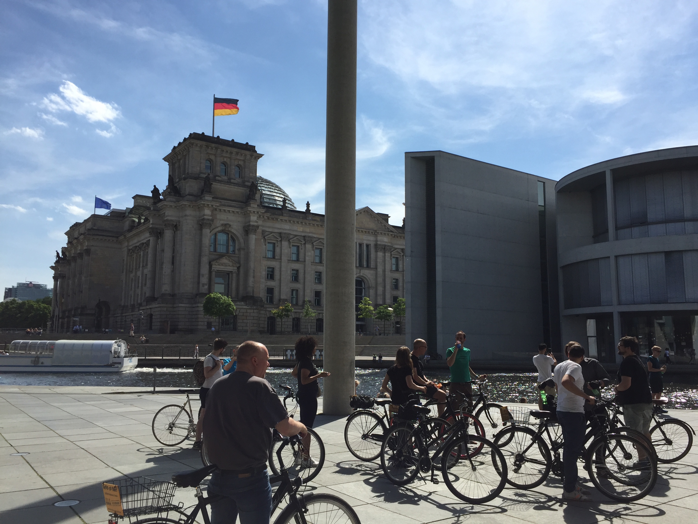
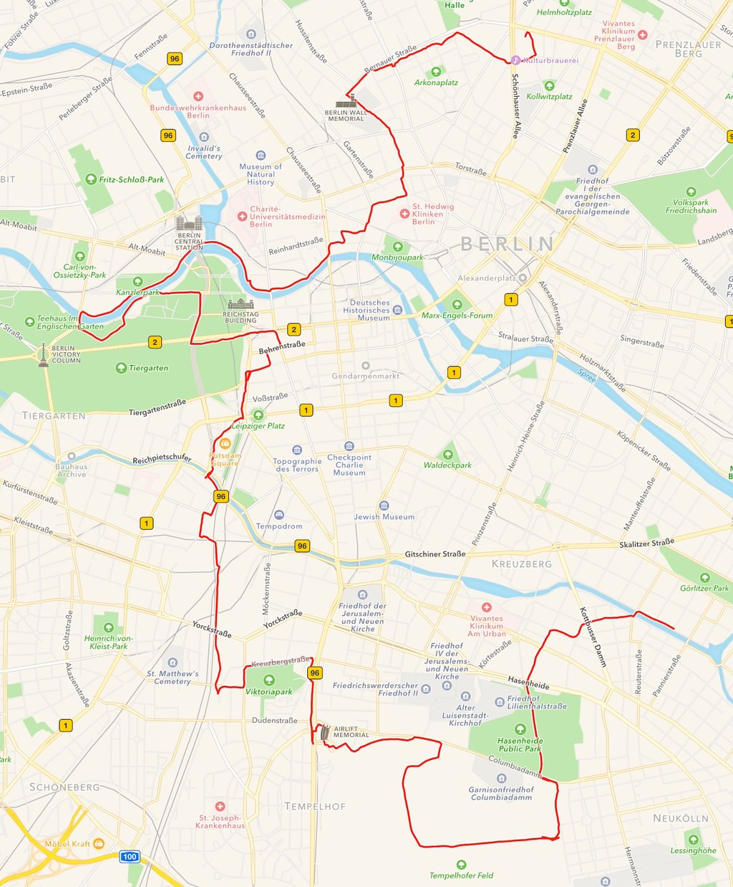
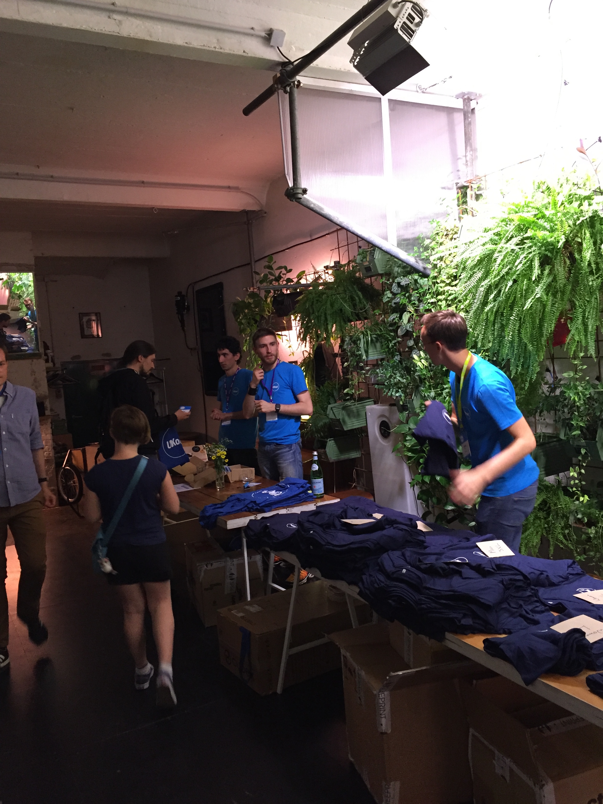
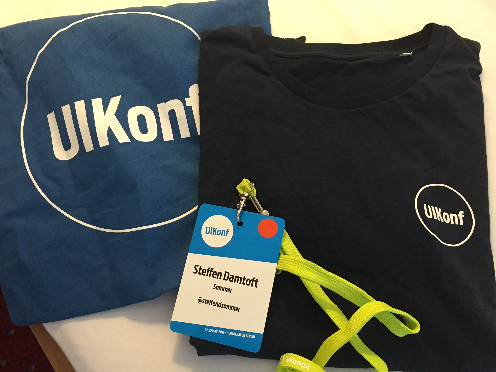
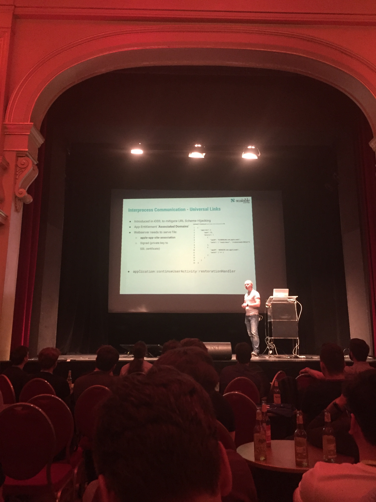
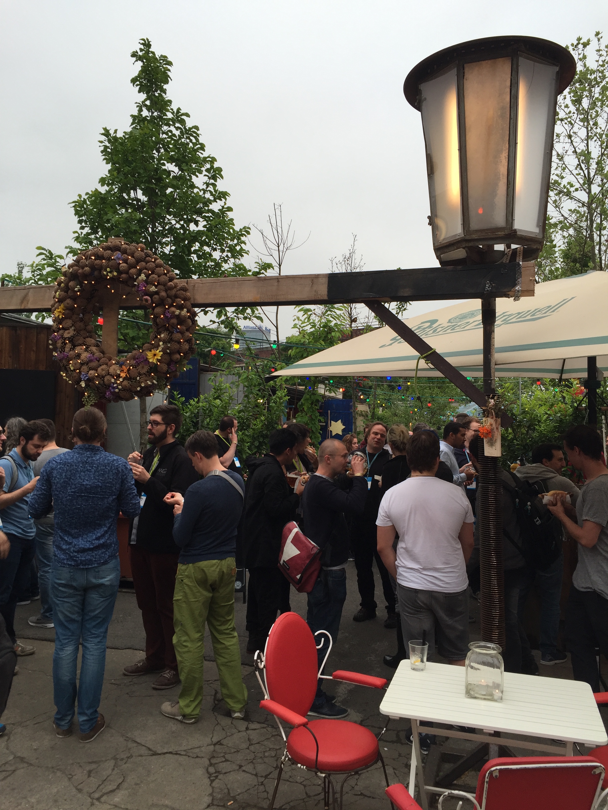

The 1st of January 2016 I wrote down a list of things I would like to do in 2016. One of them being was that I wanted to go to an iOS conference. Luckily for me, I have an awesome workplace ([Unwire](http://www.unwire.com/#/home)) who were interested in helping me to go to [UIKonf](http://www.uikonf.com) 2016. For each day at the conference I tried to write down my thoughts for any interested reader who considers going to an iOS conference or going to this specific conference.

# Day 1: Social events

I signed up for the UIKonf Bike Tour because I remembered seeing some awesome pictures from the event on Twitter last year. Also, I thought it would be a great opportunity to see the city, being a bit active, and hopefully being outside in great weather.

After meeting up at 2pm and getting our bikes we started biking through the city as one huge group (30 ish?). [@olebegemann](https://twitter.com/olebegemann) was our tour guide and he had several helpers to make sure everybody kept biking together and got safe around the city. I had my doubts about how well it would work with such a big group, but it turned out just fine.

I've been to Berlin several times and I felt like I've seen a lot of the city, but I was wrong. During the 5 hour-ish ride, we saw some pretty interesting places. One of my favourite spots of the day were the closed airport Berlin Tempelhof Airport which was one big playground for sports, creativity and joy. Overall I would say that biking around Berlin in 25 degrees and surrounded by nice and friendly people was simply just great. We ended up biking almost 25 km and here is the route we took:

 

We ended our bike tour at a restaurant with a very nice location close to a canal. It was a great opportunity to reflect on the day with the other participants as well as getting to know them even more. Oh ye, and of course drinking a cold 🍺 We ended the day by meeting with the people from all of the other social events at a pretty cool place called InFarm. Here we were able to check in and grab some free drinks before heading tired and satisfied back to the hotel.

|  |  |

# Day 2: First day with talks

After waking up with sore legs and a slight sunburn I was super excited for the actual first day with talks at UIKonf. After arriving at the beautiful venue and grabbing a delicious coffee from Companion Coffee, the talks began. Here are my top picks from the first day with talks:

## [Jeff Watkins - Legacy](https://www.youtube.com/watch?list=PLdr22uU_wISqm9QbnczWxXs9qyuWpSU4k&v=AksIrgPFSgY)

The day started with [Jeff Watkins](https://twitter.com/jeffwatkins) talking about legacy. Not as in legacy code, but as in, the legacy we leave behind when we pass on. I watch a lot of videos from iOS conferences around the world and I always think that it is refreshing to hear talks that are related to our field, but without being super technical. Jeff talked a lot about how we together as a community can contribute to a better future. He touched subjects such as race and gender discrimination and how important it is to expand our community. Definitely a lot of food for thought and a talk that must have required some courage to pull off. Lots of kudos!

## [Steve Scott - MVVM-C In Practice](https://www.youtube.com/watch?v=9VojuJpUuE8&list=PLdr22uU_wISqm9QbnczWxXs9qyuWpSU4k&index=6)

I've being working with the MVVM pattern for the last 1-2 years and I totally related to the problem [Steve Scott](https://twitter.com/macdevnet) were trying to solve using a slightly modified pattern called MVVM-C. The C in MVVM-C stands for Coordinator which tries to take the responsibility of navigation. The talk was very practical and I believe it is a great starting point for apps that are architectured using MVVM. I will personally revisit the video of the talk and try to incorporate his ideas into my thinking of MVVM.

## [Ellen Shapiro - Outside In - Using UI Tests To Start Improving Your App](https://www.youtube.com/watch?v=hYCUy-9yq_M&list=PLdr22uU_wISqm9QbnczWxXs9qyuWpSU4k&index=7)

UI testing is fairly new to me, and it is an area I've wanted to dive in for some time, but I haven't quite taken the jump yet. Since Xcode 7 introduced XCUI I've always just assumed that, that was the tool I were going to use. However, it was quite interesting to hear about [Ellen Shapiro](https://twitter.com/designatednerd)'s experiences when doing UI testing. In particular I found her comparison between KIF and XCUI very interesting because I was totally unaware of the pro's and con's between these tools. Also, I felt that her experiences with these tools will make a great starting point for me to start doing UI testing in the apps I work on.

All in all a great day with great talks, awesome coffee (and ice cream), lots of friendly people and more sunny weather ☀️

# Day 3: Second and last day with talks

Full of energy after a good night of sleep, I was excited to hear more talks on the second day with talks at UIKonf. The structure of the day was more or less the same as the first day with talks besides a very nice after party. Here are my top picks from the second day of talks:

## [Andreas Schranzhofer - App Security and Securing Apps](https://www.youtube.com/watch?v=ipMlEMnKwKs&list=PLdr22uU_wISqm9QbnczWxXs9qyuWpSU4k&index=10)

I must be very honest and say that app security is not an area within iOS development that I'm super excited about. I totally understand the importance and I strive to do what I must do in order to make secure apps, but it's not something I'm super passionate about. Because of that, I did not know what to expect of [Andreas Schranzhofer](https://twitter.com/Schranzhofer)'s talk about app security. However the talk was super practical, structured and full of super useful tips. Basically he went through a lot of different areas of an iOS app and explained how one is able to enhance the security in those specific areas.

## [Michael May - The Empathetic Programmer](https://www.youtube.com/watch?v=hXo6CWTmb9c&index=12&list=PLdr22uU_wISqm9QbnczWxXs9qyuWpSU4k)

I believe [Michal May](https://twitter.com/codermay) talked about a super important subject within the iOS community and something that we should continuously remind ourselves about: empathy. He talked about how we should remember that behind a rating, an avatar, an online profile or a pull-request, there's a human being. We should remember how we communicate with each other and in general be more empathetic. We should be aware about contexts and be open to iterate instead of recreating.

## [Daniel H. Steinberg - A Time Lapse look at Swift](https://www.youtube.com/watch?v=kyzN5I-2FoY&list=PLdr22uU_wISqm9QbnczWxXs9qyuWpSU4k&index=15)

It's pretty easy to get influenced by the critics of Swift and I think [Daniel H. Steinberg](https://twitter.com/dimsumthinking) did a really good job on reflecting on some of the criticism that Swift has received during the past 2 years since Swift was announced. He dived into the history of Swift and commented on the progress since the language was announced. A question that stood out the most to me from his talk were: "What's the rush?". Why are we so impatient about Swift getting a stable ABI and being somewhat feature complete. Daniel did a really good job on reminding us the importance about getting it right and that instead of being sceptical, we should be thankful that the team behind Apple is taking the time for doing it right. 

After the last talk, an after party were held at a place called Birgit & Bier. Besides being a super cool place, there were free food and drinks and it was great opportunity to talk to the people you met during the conference days.

# Day 4: Workshops

For the so-called "Unconference" day I signed up for the 3-hour long Test-Driven Development workshop. I've been practicing testing for the last year or so, but without really getting the habit of writing all of my tests upfront. I hoped that the workshop could give me some more knowledge about testing in general but also boost my motivation for writing tests upfront.

The workshop was divided into two parts. The first part being a presentation and mostly focused about the theory behind testing. The second part being more practical where each person tried to code the same thing as being shown on the projector.

I personally liked the first part the most which I found very interesting and packed with a lot of tips and tricks. For the practical part, I found it to be too rushed. Because the coding happened so fast, you basically had to turn off your head, and just focus on writing the same code as being presented. I would have preferred the code base we were working on to be smaller and easier to grasp or the duration of the workshop to be longer.

# Should you attend UIKonf?

Yes. Would I attend UIKonf again? Yes.

This was my first iOS conference, so of course I don't have a lot to compare against, but in terms of UIKonf meeting my expectations for an iOS conference, UIKonf succeeded. I would almost also say that the conference exceeded my expectations. Here are some the reasons for why I think UIKonf is an awesome iOS conference:

- High quality talks with a great variety and a good balance between highly experienced speakers and newcomers to the stage.
- Great coffee, food and locations which shows Berlin at its best.
- Lots of room for networking with fellow iOS developers who are super welcoming and friendly to talk with.
