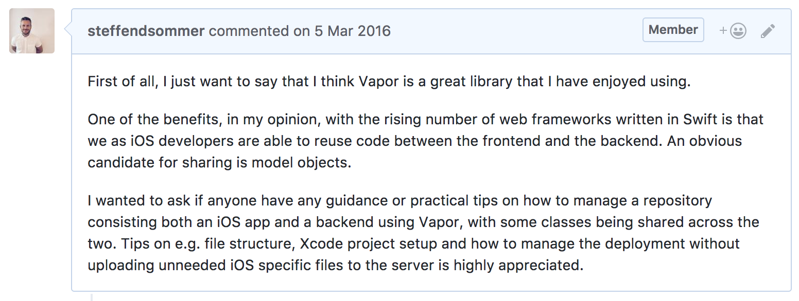

Back in 2015 I blogged about [how I landed my first job as an iOS developer](http://steffendsommer.com/blog/2015/12/22/how-i-landed-my-first-job-as-an-ios-developer/). After doing around 3 years of fulltime iOS development I decided to make a career switch. Instead of focusing on mobile development, I started to focus on backend development. The most exciting part of this switch was that I was able to continue using the programming language I had become so passionate about: Swift. Almost a year has passed and I'm now trying to look back at what I have learned from making this switch.

# How I got into server-side Swift development
After working on the iOS platform for years, I slowly started to realize that it wasn't the platform I was most passionate about, it was the language. In other words it was

> Swift as a language, not iOS as a platform

that got me all excited. After this realization I started slowly to look into the state of server-side Swift development. Something I had been following all along since the announcement of Swift being open source in 2015. I tried the top server-side Swift frameworks being [Perfect](http://perfect.org), [Kitura](http://www.kitura.io) and [Vapor](http://vapor.codes). Eventually I decided to put my focus on Vapor due to

- It had a "Swifty" syntax
- It overall had the features I needed for the projects I wanted to experiment with
- The community which seemed active and welcoming

I quickly started to focus on the popular topic around how one could share code between the iOS and the backend. Here's an issue I opened at the Vapor repo at an early stage:

Parallel to the first steps I was taking into world of server-side Swift, an app agency called [Nodes](https://www.nodesagency.com), with headquarter in Copenhagen, started to look for a new language and framework for their backends. They decided to invest in Vapor, because they liked the idea of using Swift on the server and because the framework had its similarities with [Laravel](https://laravel.com) which was the Nodes' framework of choice at that time.

Fast forwarding some months, I realized this connection between Vapor and Nodes by coincidence, and since January 2017 I have worked at Nodes trying to help and build up and lead a team for doing Vapor development. It has been a fantastic year creating more than 30 open source packages and delivering more than 25 customer projects using Vapor.

# Why I think server-side Swift development is exciting

When we talk about server-side Swift in general, I think there are some pros and cons that are worth considering.

## Pros

- Swift. I think the programming language is a big win for choosing this language for writing server-side code. It has great language features, it is fairly safe and overall I think the language encourages you to write better code. It is also a language which is liked by the developers.
- It is fast. When looking at the language itself but also when looking at some of the web frameworks, both parts performs good compared to other languages and frameworks. Further, the language has a low memory footprints which is ideal when you run your code in the cloud and you will be paying for the memory usage.
- Code re-use. The idea of potentially re-using code between multiple platforms within a project, but also just be able to create frameworks and packages that can be used on multiple platforms.
- Developer re-use. One thing is the potential of sharing code between platforms, but the other side to it is to be able to share developers. It is convenient for a company (being a small startup with few developers or a bigger company with a changing pipeline) to be able to move developers around on the different platforms.
- Xcode. I personally have a love/hate relationship with Xocde but I do think that it has gotten a lot better during the last year. The tool has some powerful features including tools for debugging and profiling your project.
- The community. Since server-side Swift is using the Swift language, we're basically tapping into an existing community which we can benefit from even though everybody is not doing server-side development.

## Cons

- Swift. It's still a new language which has caused some migration pains, compilation frustration and some reverts in the evolution process.
- Swift Package Manager. It has taken a while for SPM to catch up with other package managers out there, but it's getting there. There has and still can be some misleading errors, resolve issues where it will never finish and the format of the manifest file has been changing.
- The frameworks being Perfect, Kitura or Vapor. These frameworks are not as mature and battle tested as other frameworks written in other languages. There can be some overhead in migrating between major versions, missing libraries and the online resources (tutorials, videos etc.) might quickly get outdated since the frameworks are changing this fast.
- Xcode. It has been and can still be unstable, give you misleading error messages and it overall still has some functionality related to refactoring that are missing.
- Hosting. Even though services like Vapor Cloud, Bluemix and Heroku makes it easier to host your server-side Swift project, you'll still see that the number of options for hosting your project is less than if you would have chosen a more common server-side language and framework.

Looking at the progress for server-side Swift and the web framework within a couple of years compared to other languages and web framework, I'm really excited the future of these technologies. I think we've come a long way already and I can't wait to see what the future awaits.

# Tips on getting started with server-side Swift development
I have been very pleased with the switch I took. I am able to focus on the Swift language while being part of a development of bringing Swift to the server. It has also been a challenge coming from iOS and there's definitely been some areas I needed to dive into. Here's a couple of quick tips if you consider working with server-side Swift, coming from a mobile background:

1. Read the manual and do not be afraid to reach out in the community - even at an early stage. The Vapor Slack channel is very active and people are always available to help out in #help.
2. Learn about databases, such as MySQL. Depending on what you've used on the mobile, this might be different to you and it can be a big performance bottleneck.
3. Even though we're really close at porting `Foundation` to Linux, I would still recommend that you consider when you use the library to avoid any Linux issues when deploying your project.
4. Start reporting to services such as Bugsnag or SwiftyBeaver to make it easier to debug your project.
5. Related to considering when you use `Foundation`, I would recommend setting up a Linux virtual machine or setting up CI to run on Linux to make sure your project builds on Linux.

It's an interesting time to be part of and I hope this article gave you why and how one could start looking into server-side Swift development. Feel free to leave a commend or reach out on Twitter for any other tips or questions.